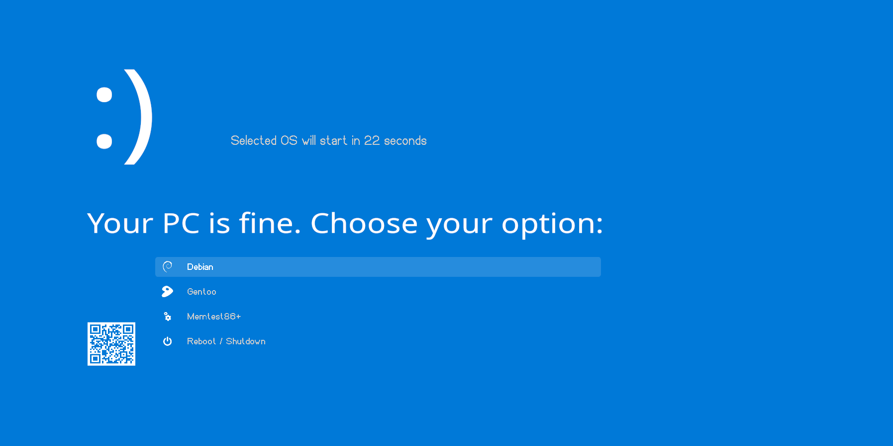

# Blue Screen of Life

Embrace the Blue Screen. 

Own this grub theme. Make it the first thing you see...



# How to Install

> :warning: **Make sure you understand what you are doing. Installation of the theme can cause problems in your system if done incorrectly** 


## Manual Installation (preferred method) 

- Clone the repo 

```
git clone https://github.com/harishnkr/bsol.git
```

- Copy the entire `bsol/` directory to `/boot/grub/themes/` or similar path depending on your distribution

- Change the `GRUB_THEME` line in `/etc/default/grub` file:

```
GRUB_THEME="/boot/grub/themes/bsol/theme.txt"
```

- For Fedora based systems only: Change the `GRUB_ENABLE_BLSCFG` and `GRUB_TERMINAL_OUTPUT` line in `/etc/default/grub` file:
```
GRUB_ENABLE_BLSCFG="false"
GRUB_TERMINAL_OUTPUT="gfxterm"
```

- Update GRUB with sudo privileges.

For Arch based systems:

```
sudo grub-mkconfig -o /boot/grub/grub.cfg
```


For Debian based systems:

```
sudo update-grub
```

For Fedora based systems:
```
sudo grub2-mkconfig -o /boot/grub2/grub.cfg
```

## Using Package manager

If you use Arch linux or derivatives, use this [package](https://aur.archlinux.org/packages/grub-theme-bsol-git)
run `grub-install --themes=bsol` followed by `grub-mkconfig -o /boot/grub/grub.cfg"` both with `sudo` privileges.


## Configuration

### Choosing font

By default, the theme uses `victor mono italic` font. Alternatives are as follows:

- Victor Mono Regular 16

To change it, change the line containing the terminal font in the `theme.txt` file. To suggest another font, open a new issue.

## Troubleshooting

Some fixes for issues that may help are as follows. All feedbacks are appreciated

- Make sure this line is commented with a `#` in the beginning:
    ```
    GRUB_TERMINAL_OUTPUT="console"
    ```
- Change resolution with this line:
    ```
    GRUB_GFXMODE="[x_res]x[y_res]x32"
    ```
    (change x_res and y_res to your screen resolution, e.g. 1920x1080)

# TODO

- Update the packages on Pling.com, Gnome-look and Opendesktop sites
- Create install script for various distros

# Credits


- [This amazing guide](http://wiki.rosalab.ru/en/index.php/Grub2_theme_tutorial)
- [y0uCeF](https://github.com/y0uCeF) for helping with the AUR package
- [This repo](https://github.com/Jacksaur/Gorgeous-GRUB) for showcasing various themes.
